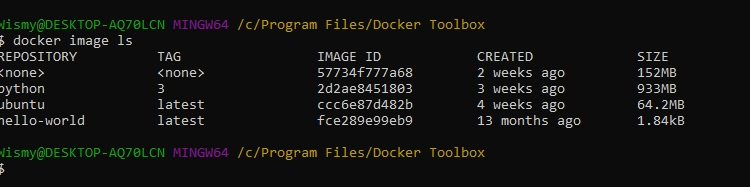
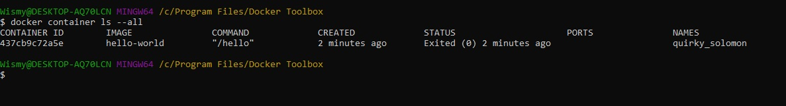
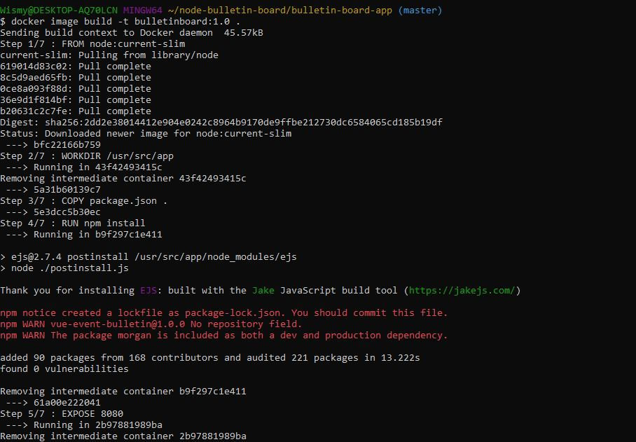
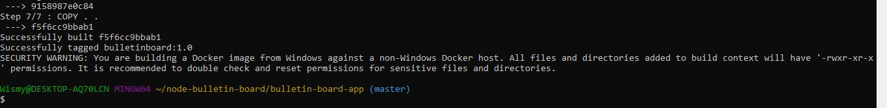
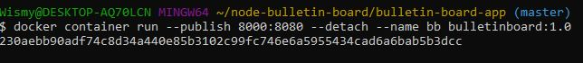
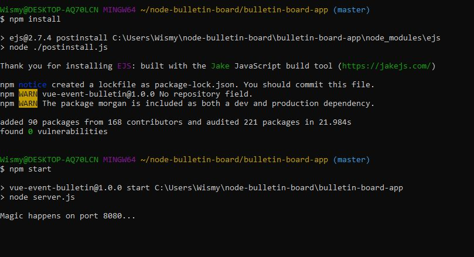
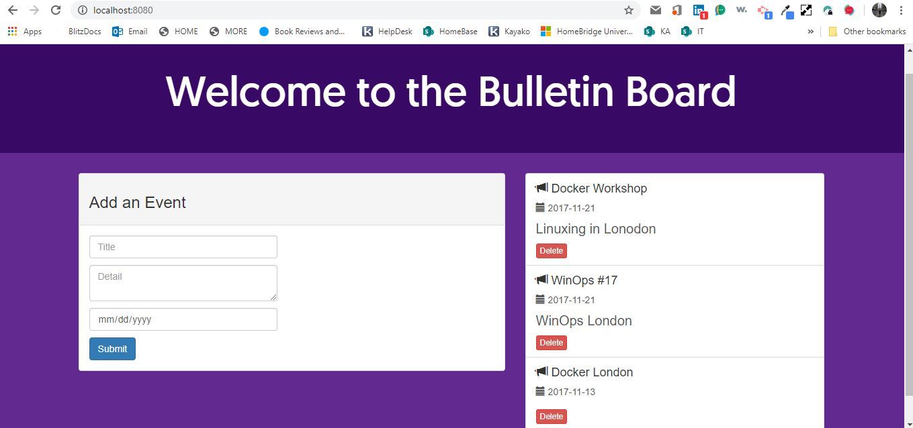

# Docker Homework Tutorial

## Section 1

### Test Docker version

type `` docker --version `` to get a response with docker version

### Test Docker Installtion

After installing Docker test the installation

1. Was not working for a while because I forgot the tack  in  ``hello-world``

2. Run `docker image ls` command line

3. List `hello-world` container by typing `docker container ls --all`

## Section 2

1. Run image as container

2. Build your image

3. Go to local host and show Bulletin Board

`npm install` the node modules first

## Section 3
