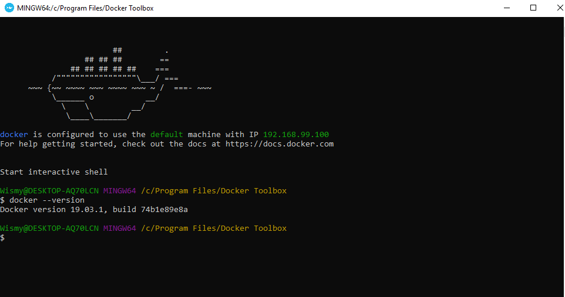
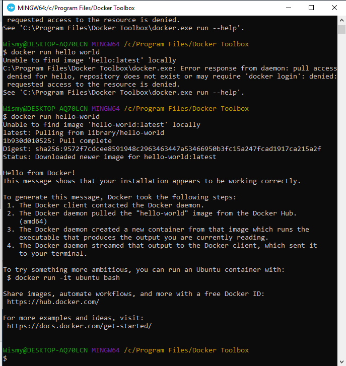
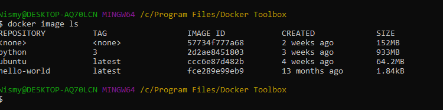
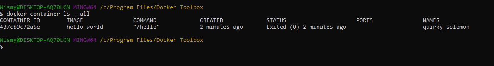

# Docker Homework Tutorial

## Section 1

### Test Docker version

### Test Docker Installtion

1. Was not working for a while because I forgot the tack  in  ``hello-world``

2. Run `docker image ls`

3. List 'hello-world` container

